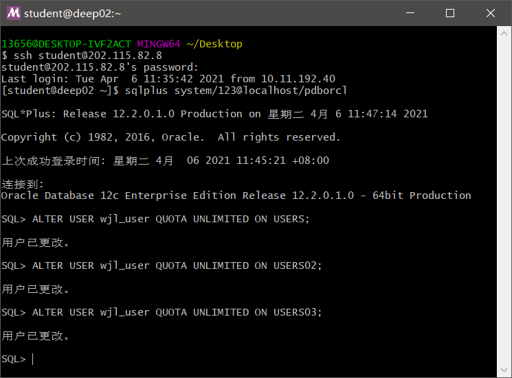

# 第二次实验
## 吴俊泠 18级 软件工程3班 201810414322

## <li>实验目的
#### 掌握分区表的创建方法，掌握各种分区方式的使用场景。

# <li>实验内容
#### <li>本实验使用3个表空间：USERS,USERS02,USERS03。在表空间中创建两张表：订单表(orders)与订单详表(order_details)。
#### <li>使用自己的账号创建本实验的表，表创建在上述3个分区，自定义分区策略。
#### <li>需要使用system用户给你自己的账号分配上述分区的使用权限。你需要使用system用户给你的用户分配可以查询执行计划的权限。
#### <li>表创建成功后，插入数据，数据能并平均分布到各个分区。每个表的数据都应该大于1万行，对表进行联合查询。
#### <li>写出插入数据的语句和查询数据的语句，并分析语句的执行计划。
#### <li>进行分区与不分区的对比实验。

# <li>实验步骤
#### <li>更改用户状态

#### <li>登录wjl_user，运行test.sql

#### <li>运行结果查看

#### <li>以system用户运行，简单查询和联表查询
    单表查询

    联表查询

#### <li>查看表空间和数据库文件及其磁盘占用情况

# <li>实验分析
#### 通过这次实验，我学会了怎么去设计分区表，以及在什么时候需要用到分区表：
##### <li>表的大小超过2GB。
##### <li>表中包含历史数据，新的数据被增加都新的分区中。
#### 表分区的优缺点：
#### 优点：
##### <li>改善查询性能
##### <li>增强可用性
##### <li>维护方便
##### <li>均衡I/O
#### 缺点：
##### <li>已经存在的表没有方法可以直接转化为分区表。不过 Oracle 提供了在线重定义表的功能。