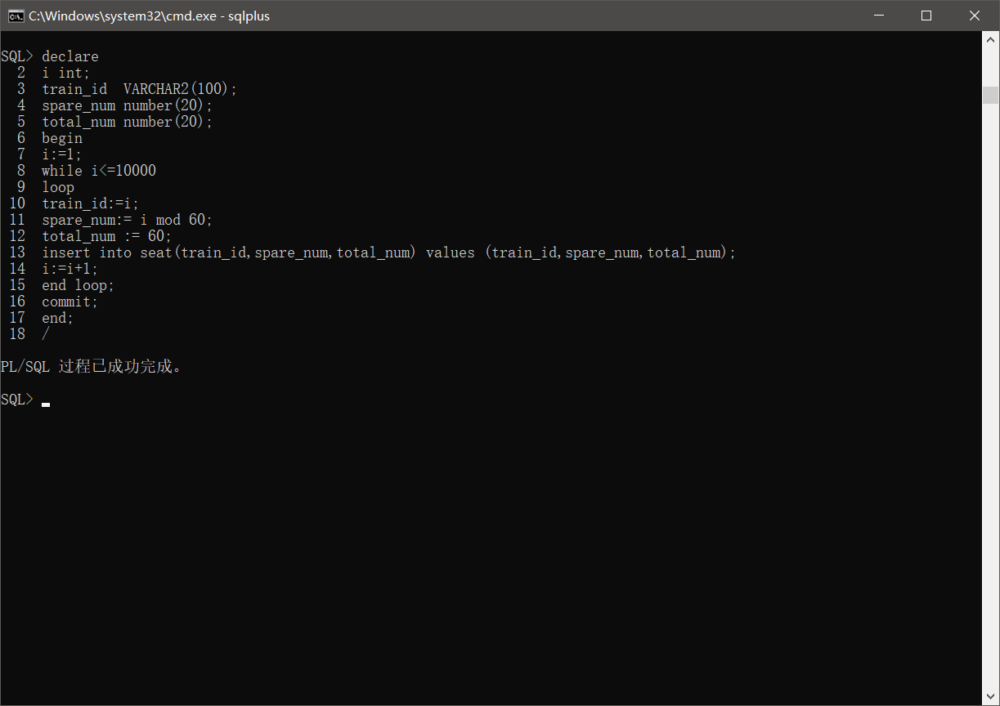

# 实验6（期末考核） 基于Oracle的火车售票系统数据库设计

## 期末考核要求

- 自行设计一个信息系统的数据库项目，自拟火车车售票系统名称。
- 设计项目涉及的表及表空间使用方案。至少5张表和5万条数据，两个表空间。
- 设计权限及用户分配方案。至少两类角色，两个用户。
- 在数据库中建立一个程序包，在包中用PL/SQL语言设计一些存储过程和函数，实现比较复杂的业务逻辑，用模拟数据进行执行计划分析。
- 设计自动备份方案或则手工备份方案。

## 1.项目简介

项目名称：火车售票系统

本项目是基于Oracle的火车售票系统数据库设计。

涉及角色/用户：管理员、普通用户

涉及表：管理员表、普通用户表、订单表、车次表、座位表、车站表、车票信息表

## 2.功能分析

### 车次管理

由管理员进行的，包含车次查询、车次增加、车次修改、车次删除，通过操作数据库来实现这些操作。

### 车站管理

由管理员进行的，包含车站查询、车站增加、车站修改、车站删除，通过操作数据库来实现这些操作。

### 用户管理

用户管理功能指两个方面，一个是指管理员和普通用户都可以对自己的用户信息进行管理，包括查看、修改等操作，另一个是指管理员对普通用户的用户管理，包括查询用户、删除用户等。

### 订单管理

由管理员进行的，包含查看订单、退订、改签，通过操作数据库来实现这些操作。

### 票务查询

由普通用户进行的，包含车次查询、车站查询、余票查询，通过从数据库匹配关键信息来实现这些操作。

### 登录注册

登录注册功能，管理员和普通用户可以进行登录和注册的功能。


## 3.数据库设计

### 3.1admin表（管理员表）

|      字段       |       类型        | 主键，外键 | 可以为空 | 默认值 | 约束 |
| :-------------: | :---------------: | :--------: | :------: | :----: | :--: |
|    admin_id     |   Integer（20）   |    主键    |    否    |        |      |
|   admin_name    | VARCHAR(100 BYTE) |            |    否    |        |      |
| admin_password  | VARCHAR(100 BYTE) |            |    否    |        |      |
|   admin_phone   |   Integer（20）   |            |    否    |        |      |
| admin_real_name | VARCHAR(100 BYTE) |            |    否    |        |      |
| admin_identity  |   Integer（20）   |            |    否    |        |      |
|  admin_comment  | VARCHAR(100 BYTE) |            |    是    |   空   |      |


<div id="TEACHERS"></div>

### 3.2consumer表（普通用户表）

|      字段      |       类型        | 主键，外键 | 可以为空 | 默认值 | 约束 |
| :------------: | :---------------: | :--------: | :------: | :----: | :--: |
|    user_id     |   Integer（20）   |    主键    |    否    |        |      |
|   user_name    | VARCHAR(100 BYTE) |            |    否    |        |      |
| user_password  | VARCHAR(100 BYTE) |            |    否    |        |      |
| user_real_name | VARCHAR(100 BYTE) |            |    否    |        |      |
| user_phone_num |   Integer（20）   |            |    否    |        |      |
| user_identity  |   Integer（20）   |            |    否    |        |      |
|   user_level   |   Integer（20）   |            |    是    |   空   |      |
|   user_point   |   Integer（20）   |            |    是    |   空   |      |
|  user_comment  | VARCHAR(100 BYTE) |            |    是    |   空   |      |

### 3.3station表（车站表）

|     字段     |       类型        | 主键，外键 | 可以为空 | 默认值 | 约束 |
| :----------: | :---------------: | :--------: | :------: | :----: | :--: |
|  station_id  |   Integer（20）   |    主键    |    否    |        |      |
| station_name | VARCHAR(100 BYTE) |            |    否    |        |      |
| station_addr | VARCHAR(100 BYTE) |            |    否    |        |      |

<div id="GRADES"></div>

### 3.4orders表（订单表）

|       字段       |       类型        | 主键，外键 | 可以为空 | 默认值 | 约束 |
| :--------------: | :---------------: | :--------: | :------: | :----: | :--: |
|     order_id     |   Integer（20）   |    主键    |    否    |        |      |
|    order_time    |       Date        |            |    否    |        |      |
|     pay_info     | VARCHAR(100 BYTE) |            |    否    |        |      |
|    order_name    | VARCHAR(100 BYTE) |            |    否    |        |      |
| order_train_info | VARCHAR(100 BYTE) |            |    否    |        |      |
|    order_seat    | VARCHAR(100 BYTE) |            |    否    |        |      |
|  order_identity  |   Integer（20）   |            |    否    |        |      |
|   order_phone    |   Integer（20）   |            |    否    |        |      |

<div id="TESTS"></div>

### 3.5numbers表（车次表）

|      字段      |       类型        | 主键，外键 | 可以为空 | 默认值 | 约束 |
| :------------: | :---------------: | :--------: | :------: | :----: | :--: |
|    train_id    | VARCHAR(100 BYTE) |    主键    |    否    |        |      |
|   start_time   |       Date        |            |    否    |        |      |
|  arrive_time   |       Date        |            |    否    |        |      |
| start_station  | VARCHAR(100 BYTE) |            |    否    |        |      |
| arrive_station | VARCHAR(100 BYTE) |            |    否    |        |      |
|   whole_time   | VARCHAR(100 BYTE) |            |    否    |        |      |
|  whole_course  | VARCHAR(100 BYTE) |            |    否    |        |      |

### 3.6seat表（座位表）

|   字段    |       类型        | 主键，外键 | 可以为空 | 默认值 | 约束 |
| :-------: | :---------------: | :--------: | :------: | :----: | :--: |
| train_id  | VARCHAR(100 BYTE) |    外键    |    否    |        |      |
| spare_num |   Integer（20）   |            |    否    |        |      |
| total_num |   Integer（20）   |            |    否    |        |      |

### 3.7ticket表（车票信息表）

|     字段     |       类型        | 主键，外键 | 可以为空 | 默认值 | 约束 |
| :----------: | :---------------: | :--------: | :------: | :----: | :--: |
|  ticket_id   |   Integer（20）   |    主键    |    否    |        |      |
|   train_id   | VARCHAR(100 BYTE) |    外键    |    否    |        |      |
| ticket_price |    Float（20）    |            |    否    |        |      |

## 4.创建表空间并插入数据

创建表空间：

user_2、train

每个表插入数据：

admin：20000条

consumer：20000条

station：20000条

orders：10000条

numbers：10000条

seat：10000条

ticket：10000条

```sql
-- 创建表空间
CREATE TABLESPACE user_2 logging DATAFILE 'D:\orcale19c\oradata\ORCL\user_2.dbf' size 64m autoextend on next 65m maxsize 10240m extent management local;
CREATE TABLESPACE train logging DATAFILE 'D:\orcale19c\oradata\ORCL\train.dbf' size 64m autoextend on next 65m maxsize 10240m extent management local;
```


创建表：

```sql
-- admin表的创建
create table admin
(
admin_id  number(20) primary key,
admin_name VARCHAR2(100 BYTE） not null,
admin_password VARCHAR2(100 BYTE） not null,
admin_phone number(20) not null,
admin_real_name VARCHAR2(100 BYTE） not null,
admin_identity number(20) not null,
admin_comment VARCHAR2(100 BYTE）
)
tablespace user_2 
pctfree 10 
initrans 1 
maxtrans 255 
storage 
(
initial 64K 
next 1M
minextents 1 
maxextents unlimited 
);                                    
```


```sql
-- consumer表的创建
create table consumer
(
user_id  number(20) primary key,
user_name VARCHAR2(100 BYTE） not null,
user_password VARCHAR2(100 BYTE） not null,
user_real_name VARCHAR2(100 BYTE） not null,
user_phone_num number(20) not null,                          
user_identity number(20) not null,
user_level number(20),
user_point number(20),                        
user_comment VARCHAR2(100 BYTE）
)
tablespace user_2 
pctfree 10 
initrans 1 
maxtrans 255 
storage                           
(
initial 64K 
next 1M
minextents 1 
maxextents unlimited 
);
```


```sql
-- station表的创建
create table station
(
station_id  number(20) primary key,
station_name VARCHAR2(100 BYTE） not null,
station_addr VARCHAR2(100 BYTE） not null
)
tablespace train 
pctfree 10 
initrans 1 
maxtrans 255 
storage                           
(
initial 64K 
next 1M
minextents 1 
maxextents unlimited 
);
```


```sql
-- orders表的创建
create table orders
(
order_id  number(20) primary key,
order_time Date not null,
pay_info VARCHAR2(100 BYTE） not null,
order_name VARCHAR2(100 BYTE） not null,
order_train_info VARCHAR2(100 BYTE) not null,                    
order_seat VARCHAR2(100 BYTE) not null,
order_identity number(20) not null,
order_phone number(20) not null                        
)
tablespace train 
pctfree 10 
initrans 1 
maxtrans 255 
storage                           
(
initial 64K 
next 1M
minextents 1 
maxextents unlimited 
);
```


```sql
-- numbers表的创建
create table numbers
(
train_id  VARCHAR2(100 BYTE） primary key,
start_time Date not null,
arrive_time Date not null,
start_station VARCHAR2(100 BYTE） not null,
arrive_station VARCHAR2(100 BYTE） not null,
whole_time VARCHAR2(100 BYTE） not null,                       
whole_course VARCHAR2(100 BYTE） not null   
)
tablespace train 
pctfree 10 
initrans 1 
maxtrans 255 
storage                           
(
initial 64K 
next 1M
minextents 1 
maxextents unlimited 
);  
```


```sql
-- seat表的创建
create table seat
(
train_id  VARCHAR2(100 BYTE） not null references numbers(train_id),
spare_num number(20) not null,
total_num number(20) not null     
)
tablespace train 
pctfree 10 
initrans 1 
maxtrans 255 
storage                           
(
initial 64K 
next 1M
minextents 1 
maxextents unlimited 
);  
```


```sql
-- ticket表的创建
create table ticket
(
ticket_id  number(20) primary key,
train_id  VARCHAR2(100 BYTE） not null references numbers(train_id),
ticket_price number(20,2) not null    
)
tablespace train 
pctfree 10 
initrans 1 
maxtrans 255 
storage                           
(
initial 64K 
next 1M
minextents 1 
maxextents unlimited 
);   
```


插入数据：

```sql
总共插入数据：100000条
admin：20000条
consumer：20000条
station：20000条
orders：10000条
numbers：10000条
seat：10000条
ticket：10000条
-- admin表的数据插入20000
declare 
i int;
admin_id number(20);
admin_name VARCHAR2(100);
admin_password VARCHAR2(100);
admin_phone number(20);
admin_real_name VARCHAR2(100);
admin_identity number(20);
admin_comment VARCHAR2(100);
begin
i:=1;
while i<=20000 
loop
admin_id:=i;
admin_name:= 'admin'|| i;
admin_password := '520'|| i;
admin_phone := '19822'|| i;
admin_real_name := 'wjl'||i;
admin_identity := '511622'||i;
admin_comment := '就离谱'||i;
insert into admin(admin_id,admin_name,admin_password,admin_phone,admin_real_name,admin_identity,admin_comment) values (admin_id,admin_name,admin_password,admin_phone,admin_real_name,admin_identity,admin_comment);
i:=i+1;
end loop;
commit;
end;
/       
```


```sql
-- consumer表数据插入20000
declare 
i int;
user_id number(20);
user_name VARCHAR2(100);
user_password VARCHAR2(100);
user_phone_num number(20);
user_real_name VARCHAR2(100);
user_identity number(20);
user_level number(20);
user_point number(20);
user_comment VARCHAR2(100);
begin
i:=1;
while i<=20000 
loop
user_id:=i;
user_name:= 'wcy'|| i;
user_password := '123'|| i;
user_phone_num := '19822'||i;
user_real_name := 'wjl'||i;
user_identity := '511622'||i;
user_level := '5'||i;
user_point := '5'||i; 
user_comment := '就离谱'||i;
insert into consumer(user_id,user_name,user_password,user_real_name,user_phone_num,user_identity,user_level,user_point,user_comment) values (user_id,user_name,user_password,user_real_name,user_phone_num,user_identity,user_level,user_point,user_comment);
i:=i+1;
end loop;
commit;
end;
/
```


```sql
-- station表的数据插入20000
declare 
i int;
station_id number(20);
station_name VARCHAR2(100);
station_addr VARCHAR2(100);
begin
i:=1;
while i<=20000 
loop
station_id:=i;
station_name:= 'xx站'|| i;
station_addr := 'xx市'|| i;
insert into station(station_id,station_name,station_addr) values (station_id,station_name,station_addr);
i:=i+1;
end loop;
commit;
end;
/
```


```sql
-- orders表的数据插入10000
declare 
i int;
order_id number(20);
order_time Date ;
pay_info VARCHAR2(100);
order_name VARCHAR2(100);
order_train_info VARCHAR2(100) ;              
order_identity number(20);
order_seat VARCHAR2(100);
order_phone number(20);
begin
i:=1;
while i<=10000 
loop
order_id:=i;
if i mod 6 =0 then
  order_time:=to_date('2000-1-5','yyyy-mm-dd')+(i mod 60);
elsif i mod 6 =1 then
  order_time:=to_date('2002-5-12','yyyy-mm-dd')+(i mod 60);
elsif i mod 6 =2 then
  order_time:=to_date('2003-5-25','yyyy-mm-dd')+(i mod 60);
elsif i mod 6 =3 then
  order_time:=to_date('2005-9-6','yyyy-mm-dd')+(i mod 60);
elsif i mod 6 =4 then
  order_time:=to_date('2006-6-22','yyyy-mm-dd')+(i mod 60);
else
  order_time:=to_date('2007-7-11','yyyy-mm-dd')+(i mod 60);
end if;
pay_info:= '未支付';
order_name := 'wjl'||i;
order_train_info :=i;
order_identity := '511622'||i;
order_phone := '19822'||i;
order_seat :='A'||i mod 60;
insert into orders(order_id,order_time,pay_info,order_name,order_train_info,order_identity,order_seat,order_phone) values (order_id,order_time,pay_info,order_name,order_train_info,order_identity,order_seat,order_phone);
i:=i+1;
end loop;
commit;
end;
/
```


```sql
-- numbers表的数据插入10000
declare 
i int;
train_id  VARCHAR2(100);
start_time Date;
arrive_time Date;
start_station VARCHAR2(100);
arrive_station VARCHAR2(100);
whole_time VARCHAR2(100);                     
whole_course VARCHAR2(100);
begin
i:=1;
while i<=10000 
loop
train_id:=i;
if i mod 6 =0 then
  start_time:=to_date('2000-1-5','yyyy-mm-dd')+(i mod 60);
elsif i mod 6 =1 then
  start_time:=to_date('2002-5-12','yyyy-mm-dd')+(i mod 60);
elsif i mod 6 =2 then
  start_time:=to_date('2003-5-25','yyyy-mm-dd')+(i mod 60);
elsif i mod 6 =3 then
  start_time:=to_date('2005-9-6','yyyy-mm-dd')+(i mod 60);
elsif i mod 6 =4 then
  start_time:=to_date('2006-6-22','yyyy-mm-dd')+(i mod 60);
else
  start_time:=to_date('2007-7-11','yyyy-mm-dd')+(i mod 60);
end if;
if i mod 6 =0 then
  arrive_time:=to_date('2000-1-5','yyyy-mm-dd')+(i mod 60);
elsif i mod 6 =1 then
  arrive_time:=to_date('2002-5-12','yyyy-mm-dd')+(i mod 60);
elsif i mod 6 =2 then
  arrive_time:=to_date('2005-9-6','yyyy-mm-dd')+(i mod 60);
elsif i mod 6 =3 then
  arrive_time:=to_date('2006-6-22','yyyy-mm-dd')+(i mod 60);
elsif i mod 6 =4 then
  arrive_time:=to_date('2007-7-11','yyyy-mm-dd')+(i mod 60);
else
  arrive_time:=to_date('2007-7-11','yyyy-mm-dd')+(i mod 60);
end if;
start_station:= '起点'||i;
arrive_station := '终点'|| i;
whole_time := (TO_NUMBER(arrive_time - start_time));
whole_course := '120'||i mod 6;
insert into numbers(train_id,start_time,arrive_time,start_station,arrive_station,whole_time,whole_course) values (train_id,start_time,arrive_time,start_station,arrive_station,whole_time,whole_course);
i:=i+1;
end loop;
commit;
end;
/
```


```sql
-- seat表的数据的插入10000条
declare 
i int;
train_id  VARCHAR2(100);
spare_num number(20);
total_num number(20);
begin
i:=1;
while i<=10000 
loop
train_id:=i;
spare_num:= i mod 60;
total_num := 60;
insert into seat(train_id,spare_num,total_num) values (train_id,spare_num,total_num);
i:=i+1;
end loop;
commit;
end;
/
```



```sql
-- ticket表的数据插入10000条
declare 
i int;
ticket_id  number(20);
train_id  VARCHAR2(100);
ticket_price number(20,2);
begin
i:=1;
while i<=10000 
loop
ticket_id:=i;
train_id:=i;
ticket_price:=dbms_random.value(400,100);
insert into ticket(ticket_id,train_id,ticket_price) values (ticket_id,train_id,ticket_price);
i:=i+1;
end loop;
commit;
end;
/ 
```


```sql
-- 查询是否插入成功
select count(*) from admin;
select count(*) from consumer;
select count(*) from station;
select count(*) from orders;
select count(*) from numbers;
select count(*) from seat;
select count(*) from ticket;
```


## 5.设计权限及用户分配方案,两类角色，两个用户

用户：

admin

拥有角色：t_admin 

分配表空间：train

c##consumer

拥有角色：t_user 

分配表空间：user

角色：

t_admin 

拥有角色：connect、resource、dba

t_user 

拥有角色：connect、resource

```sql
-- 创建角色
CREATE ROLE t_admin;
CREATE ROLE t_user;
-- 授权角色
GRANT connect,resource,dba, create table,create view,create trigger, create procedure,create sequence TO t_admin;
GRANT connect,resource, create table,create view,create trigger, create procedure,create sequence TO t_user;
-- 创建用户
CREATE USER  admin  IDENTIFIED BY 520 DEFAULT TABLESPACE train;
-- 指定用户额外表空间
ALTER USER admin QUOTA UNLIMITED ON user_2;
-- 创建用户
CREATE USER  consumer   IDENTIFIED BY 520 DEFAULT TABLESPACE user_2;
-- 指定用户额外表空间
ALTER USER consumer QUOTA UNLIMITED ON train ;
-- 分配角色给用户
GRANT  t_admin TO  admin;
GRANT  t_user TO  consumer;
```

成功截图如下：


## 6.在数据库中建立一个程序包，在包中用PL/SQL语言设计一些存储过程和函数，实现比较复杂的业务逻辑，用模拟数据进行执行计划分析

建立的包：

包名： pack

函数：

函数名：get_count(o_id num)

功能：

通过输入订单id，来查询订单表和车次表，同时返回与该订单相关的车次对应的起始车站

过程：

过程名：get_orders(t_id var)

功能：

通过输入订单id，来获取与该订单相关的车次的起始车站，并且统计同一时间段的车次数量并输出与订单相关的车票价格

```sql
-- 创建包
create or replace PACKAGE pack IS
  FUNCTION get_count(o_id num) RETURN var;
  PROCEDURE get_orders(t_id var);
END TrainPack;
-- 创建函数和过程
create or replace PACKAGE BODY pack IS
    FUNCTION get_count(o_id num) RETURN var
    AS
     x var(100);
     y var(100);
     BEGIN
       select order_train_info into y from orders where order_id=o_id;
       select start_station into x from numbers where train_id=y;
       RETURN x;
     END;
    PROCEDURE get_orders(t_id var)
    AS
        N NUMBER(20);
        L date;
        S var(20);
        R var(100);
    begin
        DBMS_OUTPUT.PUT_LINE('出发站：');
        select start_station into R from train_num where train_id = t_id;
        DBMS_OUTPUT.PUT_LINE(R);
         select start_time into L from train_num where train_id = t_id;
        select count(*) into N from train_num where start_time = L;
        DBMS_OUTPUT.PUT_LINE('车次数量：');
        DBMS_OUTPUT.PUT_LINE(N);
        select ticket_price into S from ticket where train_id = t_id;
        DBMS_OUTPUT.PUT_LINE('票价：');
        DBMS_OUTPUT.PUT_LINE(S);
    END;
END TrainPack;
/
```

测试：

```sql
-- 测试函数
select TrainPack.Get_count(11) AS 订单11起始车站,TrainPack.Get_count(12) AS 订单12起始车站 from dual;
-- 测试过程
DECLARE
  t_id var(100);    
BEGIN
  t_id := 1;
  TrainPack.Get_orders (t_id) ;  
  t_id := 2;
  TrainPack.Get_orders (t_id) ;    
END;
```

## 7.设计手动备份方案

本项目设置手动备份方案——即采用Rman备份

### 7.1创建恢复目录

```sql
-- 创建恢复目录：用来存储RMAN资料库的
create tablespace bp datafile 'D:\orcale19c\oradata\ORCL\storage.dbf' size 20m autoextend on next 5m maxsize unlimited;
-- 在恢复目录数据库中创建RMAN用户并授权
create user wjl identified by 520 default tablespace bp quota unlimited on bp;
grant connect,resource,recovery_catalog_owner to wjl;
```


### 7.2连接RMAN恢复目录数据库

```sql
-- 连接RMAN恢复目录数据库
rman catalog wjl/520
-- 创建恢复目录
create catalog tablespace bp;
-- 退出
quit
-- 确认环境信息
echo $ORACLE_SID
-- 连接到目标数据库、连接到恢复目录数据库
rman catalog wjl/520 target /
-- 向恢复目录注册数据库ORCL——此时就可以使用RMAN的恢复目录对目标数据库进行备份和恢复操作
register database;
```


### 7.3通道分配

```sql
-- 手动通道配置
run
{
allocate channel td1 device type disk;
allocate channel td2 device type disk;
allocate channel td3 device type disk;
}

-- 显示已经配置过的有默认值的参数，其中包括通道参数
show all;
```


### 7.4归档模式下备份与恢复

```sql
-- 查看数据库是否处于归档模式下
archive log list;
-- 关闭数据库
shutdown immediate
-- 重启并设置成归档模式
startup mount;
alter database archivelog;
archive log list;
alter database open;
-- 连接到目标数据库、连接到恢复目录数据库
rman catalog c##zrf_r/123 target /
-- 备份和恢复整个数据库
backup database;
```

### 7.5测试备份情况

```sql
-- 切换到保存路径
cd /home/oracle/app/oracle/recovery_area/ORCL/backupset/
-- 查看文件
ls
```

### 7.6测试恢复功能

```sql
-- 关闭数据库
shutdown immediate;
-- 退出数据库
exit
-- 切换到数据文件存储路径
cd /home/oracle/app/oracle/oradata/orcl/pdborcl
-- 查看数据文件
ls
-- 删除train_data01.dbf
rm -rf train_data01.dbf
-- 再次确认
ls
-- 启动数据库
sqlplus /nolog
conn /as sysdba
startup
-- 此时因为缺少数据文件无法启动
-- 检查此时数据库状态
select status from v$instance;
-- 连接RMAN
rman target sys/123
-- 恢复数据库
restore database;
-- 同步恢复
recover database;
-- 打开数据库
alter database open resetlogs;
-- 再次启动数据库，启动成功，检查此时数据库状态，此时状态已经打开
startup
select status from v$instance;
-- 再次切换到数据文件存储路径
cd /home/oracle/app/oracle/oradata/orcl/pdborcl
-- 查看数据文件，删除的已经还原
ls
```

## 8.项目总结

​	本次项目，是对我们本学期所有Oracle学习的总结，在本次的期末项目中，我所做的是火车售票系统的一个数据库，因为第一次接触oracle这个大型的数据库，所以在很多方面还有很多不会，于是就上网查资料并且在一些方面去询问同学来解决自己所遇到的问题，最后也算成功的完成了这个项目，不过在最后备份时出现了一些问题，在我打算删除数据库来进行后面的备份恢复时发现了无论是自己的system登录还是自己所创建的用户登录，都无法删除数据库，都提示权限不足，上网也查了资料，但仍无法解决，这也算是这个项目的一个小缺点吧。

​	最后通过这个项目，让我对Oracle有了更深的理解，也学到了许多新的知识。

